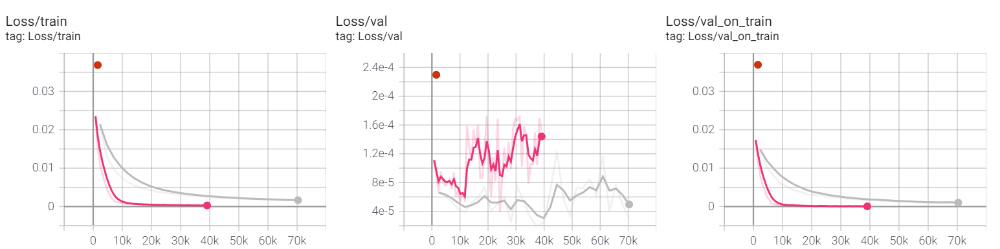

# Benchmark of Image Classification approaches on CIFAR-10 Dataset

- Implemented VGG16 and (a compact version of) ResNet from scratch via PyTorch and replicated the performance; then analyzed experimental results of other PyTorch prebuilt models then visualized through Tensorboard/matplotlib/seaborn/plotly

- Utilized hyperparameter tuning and researched on the impact of dropout layers and leaky-ReLU techniques, resulting in up to 6.25% accuracy improvement against the baseline

- Explored various data augmentation approaches and achieved up to 4.88% further improvement 

- Performed experimental analysis on techniques including gradient clipping, and model ensembling against multiple seeds

Accuracy

Loss

